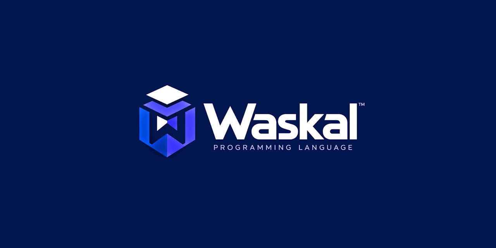
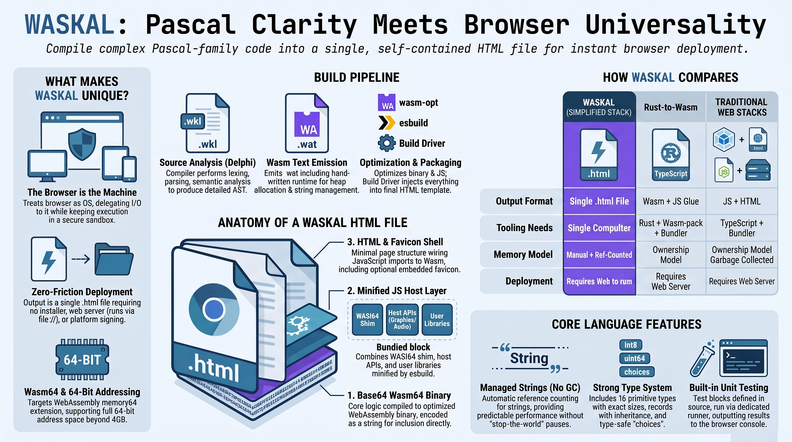

<div align="center">



[](https://discord.gg/Wb6z8Wam7p) [](https://bsky.app/profile/tinybiggames.com)

**Write Pascal. Ship one file. Runs everywhere.**

</div>

## 🔥 What is Waskal?

Waskal is a minimal, strongly typed programming language in the Pascal and Oberon tradition, with a compiler that targets the browser. It takes `.wkl` source and produces a single self-contained `.html` file: the WebAssembly memory64 binary, the JavaScript host layer, and the HTML shell, all embedded in one artifact. Double-click it, email it, upload it, serve it. It runs on any modern browser, on any OS, with nothing to install.

```waskal
module exe hello;
begin
  println("Hello, Waskal!");
end.
```

```
waskal hello
```

The output is `hello.html`. Open it in a browser. That is the deployment.

## 🎬 Media

<div align="center">
<br/>



<!-- Drag intro.mp4 into a GitHub issue or PR comment, then paste the generated user-attachments URL here -->

</div>

## 🚫 What you do not install

| | |
|---|---|
| npm, webpack, vite, a bundler | Waskal produces the finished `.html` directly. There is no JavaScript build step to configure and no `node_modules` to carry. |
| A framework, a runtime | The wasm module does the computing. The browser does everything else: display, audio, input, filesystem, networking. |
| A web server | The output works from `file://`. No hosting, no CORS configuration, no localhost. |
| wasm-bindgen, Emscripten, a JS glue layer | Every `external` declaration is a wasm import. The built-in WASI64 shim and your own `.js` files satisfy them, bundled and minified into the same file. |
| A native toolchain | The compiler is one executable. `wasm-opt` and `esbuild` ship alongside it as standalone binaries with no runtime dependencies. |

## 🎯 Who is Waskal for?

- **Programmers who want universal deployment**: one file, every OS, every device. No installer, no app store, no platform-specific build.
- **Pascal and Delphi developers** who want to target the browser without learning JavaScript or adopting a JavaScript-centric toolchain.
- **Game developers** who want to prototype or ship browser games with real wasm performance and clean code. Graphics and audio come through JavaScript host APIs.
- **Tool builders** who want to distribute utilities, calculators, dashboards, or interactive tools as single HTML files that work offline.
- **Educators** who want students to run programs instantly in a browser without installing anything.
- **Anyone tired of web development complexity** who wants to write real code in a real language and get a single file that just works.

## ✨ The language

```waskal
module exe shapes;

type
  Color = choices(red, green, blue = 5, alpha);

  Point = record
    x: float64;
    y: float64;
  end;

  Shape = record
    origin: Point;
    color:  Color;
    label:  string;
  end;

routine hsv_to_rgb(const h: float32; var r: uint8; var g: uint8; var b: uint8);
begin
  r := uint8(h * 255.0);
  g := uint8((1.0 - h) * 255.0);
  b := 128;
end;

routine safe_div(const a: int32; const b: int32): int32;
begin
  guard
    return a div b;
  except
    println("caught %s (code %lld)", cstr(excmsg()), exccode());
    return -1;
  end;
end;

begin
  var s: Shape = Shape(origin: Point(x: 10.0, y: 20.0), color: Color.blue, label: "box");
  var r: uint8;
  var g: uint8;
  var b: uint8;
  hsv_to_rgb(0.25, r, g, b);
  println("%s at (%f, %f) rgb(%d, %d, %d)", cstr(s.label), s.origin.x, s.origin.y, r, g, b);
  println("%d", safe_div(10, 0));
end.
```

- **Sixteen primitive types** with exact sizes, every one mapping to a wasm value type: `int8` to `uint64`, `float32`, `float64`, `char`, `wchar`, `boolean`, `pointer`, and managed `string` (UTF-8) and `wstring` (UTF-16).
- **Records that lay out the way you declare them**: inheritance, `packed`, `align(n)`, overlays (unions), anonymous overlays for tagged unions, bit fields, named record literals.
- **Routines**: one keyword for functions and procedures, `const` and `var` parameters, local sections, first-class routine types, overloading, forward declarations, variadics with `varargs`.
- **Control flow**: `if`, `while`, `for` and `downto`, `repeat`, `match` with ranges and lists, `break`, `continue`, compound assignment.
- **Exceptions**: `guard`/`except`/`finally` with `throw` and `throwcode`, built on the WebAssembly exception handling proposal. Zero-cost try blocks; propagates across routine and module boundaries.
- **Managed memory without a garbage collector**: strings and dynamic arrays are reference counted with deterministic cleanup. Debug builds report every leak at exit.
- **64-bit memory**: built on memory64. Pointers are `i64`, the address space grows past 4GB, and `new`/`dispose`/`getmem`/`freemem`/`resizemem` operate on linear memory.
- **Sets** as stack bitmasks of up to 64 elements: union, intersection, difference and membership are single instructions.
- **Modules**: `exe`, `lib`, `unit`. Private by default, `public` to export, always qualified on import, `initialize` and `finalize` on every kind.
- **Conditional compilation**: `@define`, `@ifdef`, `@ifndef`, `@elseif`, `@else`, `@endif` with `WASKAL`, `WASM64`, `DEBUG`, `RELEASE`, `BUILD_EXE`, `BUILD_LIB`, `BUILD_UNIT`.
- **Built-in unit testing**: `test "name" begin ... end;` blocks after `end.`, enabled by `@unittestmode on;`, with `assert`, `asserteq`, `asserteqf`, `assertnil`, `assertnotnil`, `assertfail` and more. Runs in the browser, reports to the console.
- **Embedded favicon** through the `@favicon` directive. No extra file.

## 🔗 Calling JavaScript

```waskal
module exe interop;

// a browser API, bound by name
routine get_random(): float64; external "env" name "Math.random";

// your own JS lib, bundled into the .html at build time
const CANVAS = "canvas";
routine fill_rect(x: float64; y: float64; w: float64; h: float64); external CANVAS;

begin
  var i: int32;
  for i := 0 to 9 do
    fill_rect(get_random() * 640.0, get_random() * 480.0, 8.0, 8.0);
  end;
end.
```

Every `external` is a wasm import. The first string is the import module name, `name` is the field; omit `name` and the routine's own name is used. The JavaScript host layer satisfies the import: the built-in WASI64 shim (console I/O, clock, random), opt-in host APIs, or any `.js` file you add to the project. Your JS is concatenated with the built-ins, minified by `esbuild`, and injected into the output.

A `module lib` produces a bare `.wasm` with no runtime, no JavaScript and no HTML. Public routines become wasm exports, and any host can instantiate it: a browser, Node, Deno, Wasmtime, Wasmer.

## ⚙️ The pipeline

Lexer, parser, semantic analysis and the wasm emitter all live in the compiler itself. Two bundled tools handle optimization and minification.

1. **Lexer**, keywords and the sixteen primitive types registered, not hardcoded
2. **Parser**, recursive descent for declarations and statements, Pratt for expressions; resolves `@ifdef` at parse time
3. **Semantic analysis**, every type, symbol, cross-module reference and directive resolved once and recorded on the AST
4. **Wasm emitter**, walks the enriched AST and writes `.wat`: memory64, exception handling, data and table sections, plus the hand-written runtime
5. **wasm-opt** (bundled Binaryen), assembles, validates, optimizes and strips the `.wat` into a compact `.wasm`
6. **esbuild** (bundled), concatenates the WASI64 shim, host APIs and your JS libs, then minifies to one block
7. **Build driver**, base64-encodes the `.wasm`, injects it and the JS into the HTML template, optionally embeds a favicon
8. **hello.html**, or `hello.wasm` for a `lib` module

Optimization is set by the `@optimize` directive: `none` (default, heap leak tracking active), `s`, `z`, `1`, `2`, `3`, `4`. `DEBUG` is defined at `none`; `RELEASE` at any other level.

## 📖 Documentation

| Document | Description |
|---|---|
| **[Waskal Language Reference](https://github.com/tinyBigGAMES/Waskal/blob/main/docs/Waskal.md)** | Getting started, the full language reference, module system, JavaScript interop, memory and data structures, directives, runtime library, unit testing, code style and recipes. |

## 🔨 Getting Waskal

**[Download ZIP](https://github.com/tinyBigGAMES/Waskal/archive/refs/heads/main.zip)** or fork the repo, extract it, and put `bin\` on your `PATH`. There is nothing else.

```
waskal hello
```

Pass the source name without the `.wkl` extension. The output lands next to the source unless `@outputpath` says otherwise.

| | Requirement |
|---|---|
| **Host OS** | Windows 10/11 x64 |
| **Target** | Any modern browser with wasm64 (memory64) support |
| **Runtime dependencies** | None |
| **External toolchain** | None. `wasm-opt` and `esbuild` are bundled in `bin\res\wasm\` |
| **Running the output** | Double-click the `.html`, or serve it from anywhere |

## 🔧 Building the compiler from source

For contributors who want to change the compiler itself.

| | Requirement |
|---|---|
| **Host OS** | Windows 10/11 x64 |
| **Compiler** | Delphi 12.x or higher |

**[Download ZIP](https://github.com/tinyBigGAMES/Waskal/archive/refs/heads/main.zip)** or clone the repo:

```
git clone https://github.com/tinyBigGAMES/Waskal.git
```

Open `projects\Waskal.groupproj` in the Delphi IDE and build all projects. This produces `waskal.exe` in `bin\`.

## 🤝 Contributing

- **Report bugs** with a minimal `.wkl` reproduction.
- **Suggest features**: describe the use case first, then the syntax you have in mind.
- **Submit pull requests** for bug fixes, documentation, new test cases and well-scoped features.
- **Review and discuss** open pull requests and issues.

Join the [Discord](https://discord.gg/Wb6z8Wam7p) to talk development, ask questions, or show what you are building.

## 💖 Support the project

If Waskal saves you time, helps you learn, or sparks something useful:

- ⭐ **Star the repo**: it costs nothing and helps others find the project
- 📣 **Spread the word**: write a post, mention it in a community, or share a screenshot
- 💬 **Join the community**: show what you are building and help shape what comes next on [Discord](https://discord.gg/Wb6z8Wam7p)
- 🧪 **Try examples**: real usage finds issues that synthetic tests miss
- 💖 [**Become a sponsor**](https://github.com/sponsors/tinyBigGAMES): sponsorship directly funds development, examples, and documentation

## 📜 License

Waskal is licensed under the **Apache License, Version 2.0**. See [LICENSE](https://github.com/tinyBigGAMES/Waskal#Apache-2.0-1-ov-file) for details.

Apache 2.0 is a permissive open source license that lets you use, modify, and distribute Waskal freely in both open source and commercial projects. You are not required to release your own source code. Attribution is required: keep the copyright notice and license file in place.

## 🔗 Links

- 🌐 [Homepage](https://waskal.org/)
- 🧑‍💻 [GitHub](https://github.com/tinyBigGAMES/Waskal)
- 🐞 [Issues](https://github.com/tinyBigGAMES/Waskal/issues)
- 📖 [Documentation](https://github.com/tinyBigGAMES/Waskal/blob/main/docs/Waskal.md)
- 💬 [Discord](https://discord.gg/Wb6z8Wam7p)
- 🦋 [Bluesky](https://bsky.app/profile/tinybiggames.com)
- 🎮 [tinyBigGAMES](https://tinybiggames.com)

<div align="center">

**Waskal**&#8482; Programming Language

Copyright &copy; 2026-present tinyBigGAMES&#8482; LLC
All Rights Reserved.

</div>
